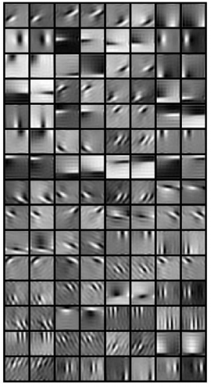

Our primary scientific interest lies in understanding how the brain forms percepts and uses them to make decisions, especially in the visual domain. In particular, we are interested in how the brain's perceptual beliefs about the outside world are represented by the responses of populations of cortical neurons and how their spiking activity gives rise to percepts and decisions. To that end we construct mathematical models that aim to explain neural responses and behavior.

**Key concepts** in the context of our work are _perceptual decision-making, probabilistic inference, neural sampling, noise correlations, choice probabilities, population responses, optimal linear read-out, feedforward, recurrent and top-down processing, covert attention, psychophysical kernel, confirmation bias_.

---
## Research directions
1. [Neural signature of hierarchical probabilistic inference](#neural)
2. [Behavioral signitures of approximate inference](#approx)
3. [Hierarchical causal inference in motion perception](#motion)
4. [Neural implementations of sampling-based inference](#sampling)
5. [Population (de)coding and perceptual decision-making](#classic)
6. [Binocular vision](#binvis)
7. [Natural image statistics](#images)

---

### Neural signature of hierarchical probabilistic inference

About...
- papers

---

### Behavioral signitures of approximate inference

About...
- papers

---

### Hierarchical causal inference in motion perception

About...
- papers

---

### Neural implementations of sampling-based inference 

About...
- papers

---

### Population (de)coding and perceptual decision-making
coding and perceptual decision-making")
How many sensory neurons contribute to a particular decision, how are they being read out (e.g. optimal or not) and which neurons are they? We have made significant progress recently towards answering these questions by deriving the analytical relationship between noise correlations, choice probabilities and read-out weights. This will allow us to answer two of these questions as soon as multi-electrode recordings from behaving animals become available, i.e. very soon.

- [Nature Neuroscience 16, 235–242 (2013)](http://www.nature.com/neuro/journal/v16/n2/full/nn.3309.html) [PDF+Code+Bibtex](http://bethgelab.org/publications/r.+m.+haefner/)

Applying this framework to neural recordings from MT during a dual motion direction and binocular discrimination task while area V2 was being cooled, we could constrain the origin of the noise correlations in MT.

- [Neuron 81(1), 208-219 (2015)](http://www.cell.com/neuron/abstract/S0896-6273(15)00561-9)

Application to MT data allowed us to investigate the neural basis of the psychophysical suppression effect.

- [Liu et al. 2016 eLife]()

---

### Binocular vision

Depth perception from binocular images is an exemplary model system for studying how the brain extracts information not explicitly present in its (2D) inputs. We have been particularly interested in understanding what feedforward computations might underlie the observed neurophysiology and how much information different binocular neuron types contain about depth.

- [Neuron 57, vol 1, 147-158 (2008)](http://www.cell.com/neuron/abstract/S0896-6273(07)00980-4) [PDF](http://lsr-web.net/Assets/NEIPages/BruceCumming/pdfs/HaefnerCummingNeuron08.pdf)
- [NeurIPS 2008](http://papers.nips.cc/paper/3461-an-improved-estimator-of-variance-explained-in-the-presence-of-noise) [PDF]() 
- [NeurIPS 2010](http://nips.cc/Conferences/2010/Program/event.php?ID=2122) [PDF](http://books.nips.cc/papers/files/nips23/NIPS2010_0590.pdf)
- [J Neuroscience, 31(22): 8295-8305 (2011)](http://www.jneurosci.org/content/31/22/8295) [PDF](http://lsr-web.net/Assets/NEIPages/BruceCumming/pdfs/TanabeHaefnerBGC2011.pdf)

---

### Natural image statistics

 Understanding the statistics of the natural world is important for understanding the properties of early sensory processing. Traditionally, this argument has been made in the context of efficient coding (Barlow) but what learning principle (objective function) is responsible for the properties of early sensory neurons, e.g. their receptive fields in the case of visual neurons, is still an open question and active field of research. Ultimately, this question is related to what generative model the brain has learnt for its sensory inputs.

- [PLoS Comput Biol 10(3): e1003468](http://www.ploscompbiol.org/article/info%3Adoi%2F10.1371%2Fjournal.pcbi.1003468)

<!-- commented junk below for copy/paste ease -->

<!--### Probabilistic (causal) inference and neural sampling -->

<!--In order to draw inferences about the outside world the brain has to combine sensory information with its learnt knowledge about the structure of the external world. How this is implemented in the brain is still unknown. By generating predictions for classic perceptual tasks, we test the hypothesis that the brain performs probabilistic inference, with neural sensory activity representing posterior beliefs in a generative model of the world.-->
<!--
- [Haefner et al. 2016 (Neuron)](http://www.sciencedirect.com/science/article/pii/S0896627316300113)
- [Lange & Haefner 2017 (Curr Opin Neurobiol)](http://www.sciencedirect.com/science/article/pii/S0959438817300442)
- [Lange & Haefner 2020 (biorxiv)](https://www.biorxiv.org/content/10.1101/081661v4)
- [Lange et al. 2020 (biorxiv)](https://www.biorxiv.org/content/10.1101/440321v3)
-->
<!--
Test of model predictions using data from macaque V1.
- [Bondy, Haefner & Cumming 2018 (Nature Neuroscience)](http://www2.bcs.rochester.edu/sites/haefnerlab/files/Bondy_etal_2018.pdf)
---
-->
